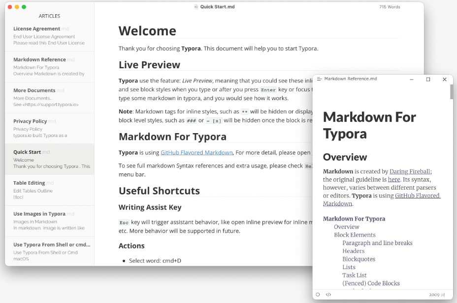

## 写作类

### [Typora](https://typoraio.cn/)

经典的 Markdown 语言编辑器。

**特点：美观，即时渲染，付费。**

### [TexStudio](https://www.texstudio.org/)

一个 Latex 语言的编辑器，用过之后体验不错。

**特点：免费，多平台**

## 梯子类

### [V2rayN](https://w1.v2free.net/)  

邮箱注册，每天都有**免费的流量**领取（大概500MB左右），如果只是用于科研等用途足够了。

**特点：操作简单**，可**白嫖**，稳定。

### [Clash for windows ](https://github.com/Fndroid/clash_for_windows_pkg)

目前还未使用过这个软件，当个V2rayN的**备用**写在这里。

官网地址：[Clash for Windows 官网地址 - Clash for Windows](https://clashforwindows.org/clash-for-windows-official/)

操作方式：[Clash for Windows 使用教程（详解，全流程） - 牛奔 - 博客园 (cnblogs.com)](https://www.cnblogs.com/niuben/p/16651185.html)

**特点：开源**

### [Watt ToolKit ](https://steampp.net/) 

原名 **Steam++**，可用于加速Steam， GitHub, Origin, Epic, Uplay 等一些常见场景，**免费使用**。如果只想上 Steam 或者 Github 的话直接开这个就能稳定访问。可以在微软商店直接下载。

**特点：开源**，**操作简单，稳定**

## 桌面整理类

### [Coodesker](https://www.coodesker.com/)

国人开发的一款开源的桌面整理软件软件。

**特点：开源，操作简单，占用内存极低**

## 同步类

### [OneDrive](https://onedrive.live.com/about/zh-cn/)

Windows上自带的同步软件，使用起来就像多了一个硬盘。

**特点：操作方便，windows自带，每个账号免费送 5G 空间，到淘宝上还能3块钱再换10G永久空间。**

缺点：同步慢，空间小。

## 待办类

### [Todo](https://todo.microsoft.com/tasks/zh-cn/)

微软官方出品，多端同步。

**特点：方便，多端同步。**

